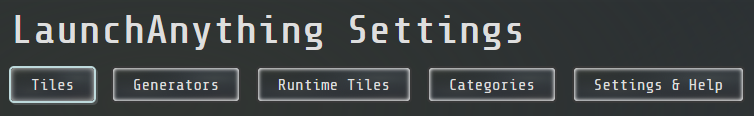
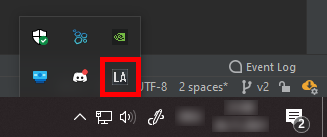

# How To use: Tips and Tricks

## Controls: Interact with the bar

- Double-tap the `ctrl` or `command` key to open the bar. Here you can enter your search query.
- Use `arrow up` and `arrow down` to navigate through the result tiles.
- Press `enter` to execute the topmost result tile.
- Press `esc` to cancel the search and close the bar.
- Use `alt` + `arrow up` and `arrow down` to scroll through your last inputs.

## Adjust everything: Settings overview

To get to the settings page, enter `settings` in the bar and hit enter. A web page will open up. These are the
navigation items:

### General

- Click on the navigation items to switch between the different pages. You can also press `tab` and `shift+tab` to
  switch between the pages.
- You can use `ctrl + z` and `ctrl + y` to undo and redo your changes.
- The changes you make to tiles and generators are being applied instantly. Some settings require a restart of the
  application to take effect. Type in `restart` to quickly restart the application.
- If the content does not on the page, you can scroll down. I cannot believe I have to explain this.

### Sections

  
Tiles

Tiles are the entries you can search for in the bar and that can execute different actions.

A list of all currently active tiles is shown on this page. Use the `Create Tile` badge to create a new tile or double
tap the `ctrl` or `command` key to open the bar and enter `Create Tile` into it.

There, you will be asked to enter a name for your tile. Do so and hit enter. Then the tile category. There are three
categories available:

- File: Opens up a file explorer that lets you select a file that will be opened up when executing the tile.
- Directory: Opens up a file explorer that lets you select a directory that will be opened up when executing the tile.
- URL: Enter a URL that should be opened up when executing the tile.
- Copy: Enter a text that should be copied to the clipboard when executing the tile.

The new tile will be added to the list of tiles.  
The individual values mean the following:

- Name: The label shown on the result tile.
- Category: Used to determine the color of the result tile.
- Keywords: Keywords which can be searched for as well.
- Actions: The actions that are being executed (in that order) when the tile is executed.

To delete a tile, right-click the name of the tile. To remove a keyword or an action, right-click it. To edit any value,
left click it.

Want to create your own tile actions? Find out how to **[write a plugin](tile-action-plugins.md)**!

  
Tile Generators

Tile generators can be used to dynamically generate tiles on application startup. There is currently only one type:

- File: Generates one tile for each file in the specified directory. The file scanner includes files in subdirectories
  as well. One or multiple extensions can be specified to only include files with those extensions (like `txt`).

The category and the keywords of the tiles are inherited from the tile generator.

Similar to the tiles: to delete a tile generator, right-click the category of the tile generator.

  
Runtime Tiles

Runtime tiles are tiles that are generated based on the current search terms. These are predetermined and therefore the
only thing you can change is the choice to deactivate them by left-clicking the according badge. These runtime tiles are
currently only available:

- **Go Website**: Enter `go` and any search term to use the `I'm Feeling Lucky` functionality and instantly open the
  corresponding website.
- **Wiki Search**: Enter `wiki` and any search term to display the short description of the Wikipedia article. Press
  enter
  to open the article in your browser.
- **Timeout**: `timeout` or `to` and a duration in minutes the bar should remain inactive. Timeout mode can be
  deactivated
  by right-clicking the system tray icon and selecting `Reset Timeout`.
- **System Info**: `sys` with one of these behind it to get the according values: `externalip or eip` `localip or lip`
  `version or ver` `os or op` `isjar or jar` `isautostart or autostart` `fonts`
- **Number Base Converter**: Enter any number and the base it is in and another base to convert it to, like so
  `10 dec to hex`, but since the keyword search is very fuzzy, something like this also works: `oct23bin`. The available
  systems are: `dec` `hex` `oct` `bin`. You can also leave away the target system to convert to all other systems.
- **URI opener**: Enter a path to a file, directory or URL, and it will be opened in your default application.
- **Aspect ratio**: A tile that can calculate a width/height based on a ratio and a single value.  
  Example: `16:9 1920:` will show `1080` as the height.  
  `3:2 :1068` will show `1602` as the width.
- **Unit Converter**: Enter a value and a unit to convert it to another unit. Example: `1 m to km`, or you can also
  leave
  away the second unit to convert to all other units: `1 joule`
  You can convert these types of units:
    - length
    - area
    - volume
    - mass
    - time
    - temperature
    - energy
    - speed
- **Timezone converter**: This function accepts up to 3 parameters: The time to convert, the zone to convert from and
  the zone to convert to. Example: `12:00 from +0300 to local time` will convert the time from UTC+3 to UTC+2 in my
  case (`2022-05-15 11:00:00 (Mitteleuropäische Normalzeit, Europe/Berlin)`).  
  If `from` and `to` are not provided, the current timezone will be used.  
  More complicated time inputs can be provided:
    - `2020-12-05 14:34:25`
    - `tomorrow 5 hours, 10 minutes and 55 seconds after midnight`
    - `in 3 hours`
- **Wolfram Alpha API**: First, go to the settings and configure your
  **[Wolfram APPID](https://developer.wolframalpha.com/portal/myapps/)**. Then enter `wolfram PROMPT alpha` to send a
  request to the api. Since only 2000 requests per month are allowed, the `alpha` is required as a confirmation, to
  prevent accidental requests.

The **math expression** tile is very powerful:

- The math evaluator can perform operations on decimals, booleans and lists/sets
- Use operators like `+`, `-`, `*`, `/`, `%` and `^` for numbers (precision is 20 digits)
- Use operators like `&&`, `||`, `!`, `=` for booleans (`true` and `false`)
- Lists can be created using the `range()`, `list()` and `set()` functions
- Functions can take a certain amount of parameters and each return a certain type of value. For all functions and
  operations, enter `function` in the launch bar
- Lists can be filtered or mapped using the `filter()` and `map()` functions by providing the filter or map function
  as first parameter, the list as second parameter and the parameters for the filter or map function as following
  parameters.
- Create functions by using `functionname(parameter1, parameter2) = functionbody` to declare custom functions.
  Currently not supported in mapping and filtering.
- Variables can be assigned to using `varname = value`, or multiple variables can be assigned at once by using
  `varname1 = value1; varname2 = value2; ...`
- Hex, binary and octal numbers can be entered using `0x`, `0b` and `0o` as prefix. Convert to different systems by
  using `toHex` and `toBin`
- Strings are supported by using `"string"`. String can be concatenated using `+`, multiplied using `*` and used as
  parameter in several functions, such as `replace`, `split` and `join`.
- Sort a list or several function arguments using `sort`. A function can be passed as first parameter to use as
  comparator.

Examples:

- `12 + 4` = `16`
- `12 + (55 % 23 + 2)` = `23`
- `filter(isPrime, range(2, 10))` = `[2, 3, 5, 7]`
- `isNotPrime(x) = !isPrime(x)` --> `isNotPrime(23)` = `false`
- `map(factorize, set(34, 34, 22, 84))` = `[[2, 17], [2, 11], [2, 2, 3, 7]]`
- `map(product, map(factorize, set(34, 34, 22, 84)))` = `[34, 22, 84]`
- `true || false && true` = `true`
- `a = 23; b = 54; c = 82` = `3 assignments a = 23, b = 54, c = 82`
- `toHex(23 + 0b1001 + 0o23 + 0x2DF)` = `0x312`
- `toDec("0b" + "10" * 3)` = `42`
- `if(3 == x, 15, x)` (returns `15` if `x` is `3` and `x` otherwise)
- `join("=", split("this is a test", " "))` = `this=is=a=test`
- `negLen(x) = -len(x)`  
  `isNotMinusEight(x) = x != -8`  
  `filter(isNotMinusEight, sort(len, sort(map(negLen, list("wowowodd", "", "testdd", "ddddddhmm")))))` = `[ 0, -9, -6]`
- ... and a lot more!

**Chart generator**:

- The graph generator can create charts for one or multiple expressions. You can enter multiple expressions by
  separating them with a semicolon: `sin(x);cos(x)`.
- The range and resolution used by the graph generator can be changed by entering `for start,end,step` after the
  expression: `sin(x);cos(x) for 0,10,0.1`.
- If no step size is specified, a fitting step size is being derived from the range size.
- The custom functions from the math expression tile can be used in the graph generator.

If you have ideas for more runtime tiles, please create an issue using the link below.  
Or, if you want to create a runtime tile plugin, please follow these **[instructions](runtime-tile-plugins.md)**.

  
Categories

Every tile (generated tiles as well) have categories. The categories are used to determine the color of the tile and can
be used as a search term. There are a few default categories:

- file (blue)
- url (orange/red)
- copy (yellow)
- runtime (green)
- settings (red)

But of course you can add as many categories as you like.

  
Cloud Tiles

Here, you can configure an API URL and log into your account to have your cloud tiles automatically synchronized between
all your devices.

See **[cloud-tiles.md](cloud-tiles.md)** for more information.

### Section: Settings & Help

Here you can find some general help and most importantly: the settings for the bar. Here you can customize almost every
value that is being used to determine the behavior of the bar. Some of these settings require a restart of the
application to take effect.

If you somehow messed up the settings, you can always use the `Reset to default values` button to reset the settings to
their default values. Alternatively you can delete the `settings.json` file and the default settings will be restored.

## System tray

While the application is running, a system tray icon is shown in the bottom right corner of the screen (or wherever your
taskbar is located). This icon can be right-clicked to open/reset the settings, exit/restart the bar or end the timeout
mode.

## Tips & Tricks: Advanced usage

If you use this bar, you're most likely like me and want to reach peak efficiency. Here are some advanced tips:

#### How the search works

When entering a search term, the bar will

- search for all tiles that contain all search terms (words split by spaces) in their name, keywords or category.
- use the search term to advance character per character in the name, keywords or category, while being able to skip to
  the next uppercase letter or character after a space character.  
  Which means that this search: `fiz` will find a tile with this name `FileZilla`, as it first matches `fi` in `File`
  and then `z` in `Zilla`. You can create some elaborate keywords that allow you to search for much shorter terms.

#### Fuzzy inputs

Most of the runtime tiles match the input very loosely. In most cases, spaces are ignored and the search is
case-insensitive. So, this input `sys Local IP` is the same as `syslocalip` (or even better `syslip`). Another example:
`g(x) = sin(x) + 2 * x for 1,10` --> `gx=sin(x)+2xfor1,10`. This can save a lot of time if done consistently.

#### Cloud Tiles

Using the cloud tiles feature, you can synchronize your cloud tiles between all your devices. This is especially useful
for URL tiles, as those are the device independent ones.  
Find out how to set up this for you in the **[cloud-tiles.md](cloud-tiles.md)** file.

No, really. They have changed they way I use the launch bar. I think they were one of the best additions so far.

#### Execute the last executed tile

To execute the last executed tile, you can leave the bar empty and hit enter. Useful when creating a lot of new tiles.

#### Start the webserver on startup

You can pass the `-ws` flag to the application to start the webserver on startup after a short delay. This is done
automatically when you restart the application using the `Restart LaunchAnything` tile while the webserver is open. This
ensures that if you restarted the application from the settings, you can still access the webserver after it has
restarted.

#### Export / Import tiles and settings

The tiles and settings are stored in JSON files in the `res` directory. You can copy those files to a different instance
of the application and directly use them there.

#### Modify the topmost tile

If you press `alt+enter` (or whatever keys you have configured in the settings) while the bar is active, you can quickly
modify the name, action or both of the topmost tile.

#### Backups

Whenever the tiles are successfully loaded from the `res` directory, a backup with the current timestamp is created in
the `backups` directory. If something goes wrong while loading the tiles, the user is asked if they want to restore the
latest backup. There is a maximum of 12 backups that are kept, older ones are deleted. This can be configured in the
settings.

#### Create Tiles

To quickly create tiles, you can use the `Create Tile` tile. This is a lot faster than opening the settings and doing it
over there.

## That's it!

I hope you can put this tool to good use. If you have any questions, suggestions or comments, feel free to contact me or
to create an issue on the **[GitHub repository](https://github.com/Skyball2000/launch-anything/issues)**.  
If you're feeling especially generous, you can also **[buy me a coffee](https://www.paypal.com/paypalme/yanwittmann)**!
