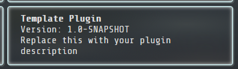
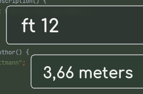

# Runtime Tile Plugins

You can create your very own runtime tiles by writing a plugin for the LaunchBar:



## What is a runtime tile?

A runtime tile, as the name suggests, is a tile generator that generates tiles based on the current input the user
inputs into the LaunchBar. These tiles are then displayed as result tiles and the user can select one of them. If the
input changes, all runtime tiles are deleted and new ones are generated.

This is done using the `generateTiles` method, located in a class implementing the `RuntimeTile` interface. Here is an
example of the go website runtime tile, which checks if the user enters `go` and some string behind that. If that is the
case, the plugin generates a tile that links to the DuckDuckGo I'm feeling lucky search.

```java
public List<Tile> generateTiles(String search, AtomicReference<Long> lastInputEvaluated) {
    if (search.startsWith("go") && search.length() > 2) {
        Tile tile = new Tile("I'm Feeling Lucky!");
        tile.setCategory("runtime");
        String searchTerm = search.replaceAll("^go *", "");
        TileAction action = new TileAction("url", "https://duckduckgo.com/?q=!ducky+" + Util.urlEncode(searchTerm));
        tile.addAction(action);
        return Collections.singletonList(tile);
    }
    return Collections.emptyList();
}
```

## Creating a plugin

First, clone this repository to your local machine:

```bash
git clone https://github.com/Skyball2000/launch-anything.git
```

Then navigate to the
**[launch-anything-plugins\src\main\java\la\plugin](../launch-anything-plugins/src/main/java/la/plugin)** directory.
Here you will find a
**[template for a plugin](../launch-anything-plugins/src/main/java/la/plugin/PluginTemplate.java)**, that you can use as
a starting point. Rename the file and class to whatever plugin you want to create.

Make sure the plugin implements the `RuntimeTile` interface. This forces you to implement the following methods:

- `generateTiles(String search, AtomicReference<Long> lastInputEvaluated)`
- `String getName()`
- `String getDescription()`
- `String getAuthor()`
- `String getVersion()`

The last four methods are used to display information about the plugin in the settings section. The `generateTiles`
method is where the input is evaluated and the tiles are generated. This means, that the plugin has to be able to react
to any input the user enters and return either an empty list if the input does not match a certain criteria or a list of
tiles if it does.

You can also implement a default constructor that takes no arguments. This constructor will be called upon loading or
reloading the plugin in the bar.

When you are done, open your command line and navigate to the project root directory. Execute the following commands:

```bash
mvn clean install
cd launch-anything-plugins
mvn clean package
```

The first one installs the `launch-anything-application` module, which is required for the plugins to work. You will
only have to perform this command once (per release or plugin api change of the launch-bar).  
The other one builds the actual plugin. Now from the `target` directory, copy either the jar file
(`launch-anything-plugins-VERSION.jar`, rename it as you want) or the `.class`  file containing the plugin into the
`res/plugins/la/plugin/` directory of your launch bar and restart/reload it.

As an example, I will create a plugin that converts between feet and meters.  
So, I create a new file called `FeetToMeters.java` in the plugin module, and I add the following code:

```java
package la.plugin;

import bar.tile.Tile;
import bar.tile.TileAction;
import bar.tile.custom.RuntimeTile;

import java.util.Collections;
import java.util.List;
import java.util.concurrent.atomic.AtomicReference;

public class FeetToMeters implements RuntimeTile {

    public FeetToMeters() {
        info(this, "FeetToMeters plugin loaded");
    }

    @Override
    public List<Tile> generateTiles(String search, AtomicReference<Long> lastInputEvaluated) {
        if (search.startsWith("ft")) {
            Tile tile = new Tile();
            tile.setCategory("runtime");
            String searchTerm = search.replaceAll("^ft *", "");
            try {
                double feet = Double.parseDouble(searchTerm);
                double meters = feet * 0.3048;
                tile.setLabel(String.format("%.2f meters", meters));
            } catch (NumberFormatException e) {
                return Collections.emptyList();
            }
            return Collections.singletonList(tile);
        } else if (search.startsWith("m")) {
            Tile tile = new Tile();
            tile.setCategory("runtime");
            String searchTerm = search.replaceAll("^m *", "");
            try {
                double meters = Double.parseDouble(searchTerm);
                double feet = meters * 3.28084;
                tile.setLabel(String.format("%.2f feet", feet));
            } catch (NumberFormatException e) {
                return Collections.emptyList();
            }
            return Collections.singletonList(tile);
        }
        return Collections.emptyList();
    }

    @Override
    public String getName() {
        return "Feet - Meters converter";
    }

    @Override
    public String getDescription() {
        return "Convert between feet and meters";
    }

    @Override
    public String getAuthor() {
        return "Yan Wittmann";
    }

    @Override
    public String getVersion() {
        return "1.0-SNAPSHOT";
    }
}
```

Then build it using the commands above, copy it into the `res/plugins/la/plugin` directory and restart the bar.
This happens if I enter a valid string into the bar:



And that's a first plugin!

## Custom tile actions

Sometimes the built-in actions are not enough. For example, if you want to access some file on the file system, there is
no built-in action for that. So, you have to implement your own action:

```java
Tile tile = new Tile("Template Plugin Tile", "Template", "", false);
TileAction action = new TileAction(() -> {
    Util.popupMessage("Template Plugin Tile", "You executed the Template Plugin Tile!");
});
tile.addAction(action);
```

This can be done by passing a `RuntimeTileInteraction` instance to the `TileAction` constructor. It has a `run` method
that will be called when the action is executed.
