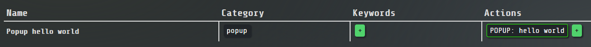

# Tile Action Plugins

You can add custom actions by creating a plugin for the Launch Bar.



## What is a Tile Action?

Tile actions are where you specify what a tile will do when executed. It has attributes and can be modified and
executed. By default, there are `TileActionFile`, `TileActionURL`, `TileActionCopy`, and several more. They all extend
the `TileAction` class. With this, they are forced to implement several methods, one of them being the `execute` method
that is called when the tile is executed.

As an example, this is the `execute` method of the `TileActionFile` class which opens a file from the `path` attribute:
```java
try {
    Desktop desktop = Desktop.getDesktop();
    File myFile = new File(path);
    desktop.open(myFile);
} catch (IOException e) {
    TrayUtil.showError("Tile action failure: unable to open file: " + e.getMessage());
    LOG.error("error ", e);
}
```

## Creating a plugin

First, clone this repository to your local machine:

```bash
git clone https://github.com/YanWittmann/launch-anything.git
```

Then navigate to the
**[launch-anything-plugins\src\main\java\la\plugin](../launch-anything-plugins/src/main/java/la/plugin)** directory.
Here you will find a
**[template for a plugin](../launch-anything-plugins/src/main/java/la/plugin/TileActionPlugin.java)**, that you can use
as a starting point. Rename the file and class to whatever plugin you want to create.

Make sure the plugin extends the `TileAction` superclass. This forces you to implement the following methods:

- `String getType()`
- `void execute(Main main)`
- `String getExampleTileLabel()`
- `JSONObject toJSON()`
- `String[] getParameters()`
- `boolean equals(Object o)`
- `boolean equalsByParams(String... params)`
- `boolean userModifyActionParameters()`
- `String getClipboardSuggestedParameters()`

and a default constructor and a constructor that takes a JSONObject. These are quite a lot of methods, but they are all
required. Step by step:

1. Specify what attributes the tile action has by creating private attributes.
2. Implement the `getType()` method. This returns the type of the tile action and is effectively the action name.
3. Implement the `toJSON()` method. This JSONObject will be used to rebuild the tile action on load. This means, it has
   to contain all the attributes that the tile action has and the type. An example:
   ```java
   JSONObject json = new JSONObject();
   json.put("type", getType());
   json.put("text", message);
   return json;
   ```
   The attributes specified here will also be displayed on the settings page.
4. Create a constructor that takes a JSONObject. This constructor will be called when the tile action is loaded from
   the JSONObject. It will set the attributes of the tile action from the JSONObject.
5. Implement the `execute(Main main)` method. This method is called when the tile action is executed. Do whatever you
   want your tile to do here. You can use your attributes and all other methods available from here.
6. Implement the `String getClipboardSuggestedParameters()` method. This method should return a proposed parameter based
   on the clipboard contents. This is so that the user doesn't have to type/paste in the parameters manually. You can
   perform checks on whether the data is a valid string for this tile action or simply return some other value. This is
   the method body for the `TileActionFile` class:
   ```java
   try {
       File file = new File(Util.getClipboardText());
       if (file.exists() && file.isFile()) return file.getAbsolutePath();
       return null;
   } catch (Exception ignored) {
   }
   return null;
   ```
7. Implement the `String getExampleTileLabel()` method. This will suggest a label for the tile that the action is
   contained in. This can be as complicated as you want, this is the method body for the `TileActionURL` class which
   will attempt to get the website title from the URL before returning simply the URL:
   ```java
   // check if the website title is available
   String websiteTitle = Util.getWebsiteTitle(url);
   if (websiteTitle != null) return websiteTitle;

   // otherwise, use the url parts to generate a label
   try {
       URL url = new URL(this.url);
       StringBuilder sb = new StringBuilder();
       if (url.getHost() != null) sb.append(url.getHost());
       if (url.getPath() != null) {
           sb.append(" ->");
           sb.append(url.getPath().replace("/", " ").replaceAll("\\?.*", "").replaceAll(" +", " "));
       }
       return sb.toString();
   } catch (MalformedURLException e) {
       e.printStackTrace();
   }

   // if all else fails, just use the url
   return "URL " + this.url;
   ```
8. Implement the `String[] getParameters()` method. Simply return a string array containing all attributes.
9. Implement the `boolean equals(Object o)` method. This method is used to compare two tile actions at different
   occasions all over the program. Make sure to compare all relevant attributes.
    ```java
    if (o instanceof TileActionURL) {
        TileActionURL other = (TileActionURL) o;
        if (o == this) return true;
        return other.url.equals(url) || fuzzyCompare(other.url, url);
    }
    return false;
    ```
10. Implement the `boolean equalsByParams(String... params)` method. This method is used to compare two tile actions
    only based on the parameters. This is used to find tile actions that should be edited/deleted triggered by the user
    clicking on the action in the settings.
    ```java
    return params.length == 1 && fuzzyCompare(params[0], url);
    ```
11. Implement the `boolean userModifyActionParameters()` method. This is executed when the user has the intent to
    edit/create the tile action. Handle everything related to the user input here. You can use the `Util` class to open
    popups that the user can use to input the parameters. You can also check if the user has entered valid parameters.
    Return `true` if the parameters have been modified, `false` if not.
    ```java
    String suggested = getClipboardSuggestedParameters();
    File file;

    if (suggested != null) file = Util.pickFile(new File(suggested), null);
    else file = Util.pickFile(null);

    if (file != null) {
        if (!file.exists()) TrayUtil.showWarning("File does not exist: " + file.getAbsolutePath());
        path = file.getAbsolutePath();
        return true;
    }

    return false;
    ```

Here's a complete example of a tile action:

```java
package la.plugin;

import bar.Main;
import bar.tile.action.TileAction;
import bar.util.Util;
import org.json.JSONObject;

public class TileActionPlugin extends TileAction {

    private String text;

    public TileActionPlugin() {
    }

    public TileActionPlugin(JSONObject json) {
        this.text = json.optString("text", null);
        if (this.text == null) this.text = json.optString("param1");
    }

    @Override
    public String getType() {
        return "popup";
    }

    @Override
    public void execute(Main main) {
        Util.popupMessage("Custom Tile Action", text);
    }

    @Override
    public String getExampleTileLabel() {
        return "Popup " + text;
    }

    @Override
    public JSONObject toJSON() {
        JSONObject json = new JSONObject();
        json.put("type", getType());
        json.put("text", text);
        return json;
    }

    @Override
    public String[] getParameters() {
        return new String[]{text};
    }

    @Override
    public boolean equals(Object o) {
        if (o instanceof TileActionPlugin) {
            TileActionPlugin other = (TileActionPlugin) o;
            return other.text.equals(text) || fuzzyCompare(other.text, text);
        }
        return false;
    }

    @Override
    public boolean equalsByParams(String... params) {
        return params.length == 1 && fuzzyCompare(params[0], text);
    }

    @Override
    protected boolean userModifyActionParameters() {
        String suggested = getClipboardSuggestedParameters();
        if (suggested == null) suggested = text;

        String newText = Util.popupTextInput("Tile Action", "Enter the text to show in a popup", suggested);

        if (newText != null && !newText.isEmpty()) {
            text = newText;
            return true;
        }

        return false;
    }

    @Override
    protected String getClipboardSuggestedParameters() {
        return Util.getClipboardText();
    }
}
```

## Build and install

When you are done, open your command line and navigate to the project root directory. Execute the following commands:

```bash
mvn clean install
cd launch-anything-plugins
mvn clean package
```

The first one installs the `launch-anything-application` module, which is required for the plugins to work. You will
only have to perform this command once (per release or plugin api change of the launch-bar).  
The other one builds the actual plugin. Now from the `target` directory, copy either the jar file
(`launch-anything-plugins-VERSION.jar`, rename it as you want) or the `.class`  file containing the plugin into the
`res/plugins/la/plugin/` directory of your launch bar and restart/reload it.

That's it! You can now use the plugin in your launch bar. If you have any questions, feel free to contact me or create
an issue on the GitHub repository.
