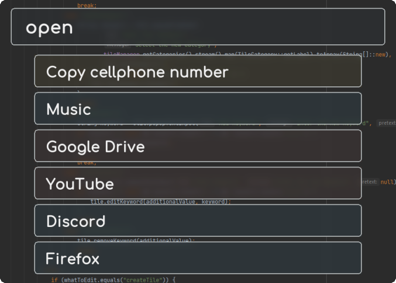

### _A search bar for anything you need_

Use this application to launch a variety of processes on your system.  
Currently only supports Windows, but might be expanded to support other platforms. This is because the global key
detector is based on the Windows API.

## Features

- A search bar available from anywhere with only two keystrokes
- Open files and directories
- Open URLs in the browser
- Copy text to the clipboard
- Tile Generators: generate tiles for files in a given directory
- Runtime Tiles:
    - Solve mathematical expressions with variables
    - Display charts for mathematical functions
    - Copy system information like the local IP address
    - Convert between number systems
    - Use the I'm feeling lucky functionality to open any webpage
    - Directly go to a wikipedia article
- Disable (timeout) the bar for a given amount of time

## Quick Setup

- Download the **[latest version](https://github.com/Skyball2000/launch-anything/releases)** and place the jar file in
  any directory on your system that you want the base directory to be
- Start the jar file with at least Java 8
- Double-Tap `command` or `ctrl` to open the search bar
- Type in some search terms and navigate the results using the arrow keys
- Press `enter` to execute the topmost result tile

For a more complete how-to, see this **[document](doc/how-to.md)**.

## Bar Settings

After having started the application, open up the search bar by double-tapping `command` or `ctrl`, type in `settings`
and hit enter. This will open up a webserver and the corresponding web page in your browser. A more detailed description
of this settings page can be found **[here](doc/how-to.md)**.

## Trouble Shooting

If the activation key (double `ctrl` or `command`) is not working, try changing the activation key in the settings page
by right-clicking the tray icon in your dock and selecting `Settings`. There, in the `Settings & Help` tab, you can
change the activation key by clicking on the `activationKey` button.

## Build it yourself

To build the launch bar yourself, perform these actions:

1. Clone and install the entirety of **[steos jnafilechooser](https://github.com/steos/jnafilechooser.git)** using Maven
   (`mvn install`)
2. Build this project using Maven (`mvn package`)
3. The jar will be located in the `target` directory

## Have fun using the LaunchAnything bar!

If you like this application and want to support my work, you can
**[buy me a coffee](https://www.paypal.com/paypalme/yanwittmann)**!
