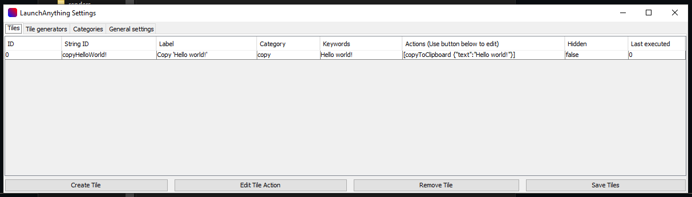

# Launch Anything
### _A search bar for anything you need_

Use this application to launch a variety of processes on your system.

## Features

- Open files
- Open files inside a specified directory
- Open music files inside a specified directory
- Copy text to the clipboard
- Open URLs in your browser

## Setup

Download the [latest version](https://github.com/Skyball2000/launch-anything/releases) of the LaunchAnything bar and extract the `.zip`.  

If you open the `launch-anything.jar` jar file, you will see the settings:

Here you can set up `Tiles` that you want to be able to search for. Click on `Create Tile` to select a preset.
To edit the tile data afterwards, simply edit the table value and click on `Save Tiles` in the bottom right.  
To edit a tile's action, click on `Edit Tile Action` and enter the ID of the tile. You can add as many actions as you want. You have these actions available:

- `openFile` with the parameter `path`
- `openURL` with the parameter `url`
- `copyToClipboard` with the parameter `text` (use `EOL` for a new line)
- `settings` with the parameter `setting` (set to either `exit`, `settings` or `lafolder`)

You can join multiple parameters by using `&&&`.

The next tab are the `Tile Generators`, which create tiles dynamically each time when starting up the LaunchBar. These are the generators that are available:

- `music` generates tiles based on the music files in the given directory
- `file` generates tiles based on the files in the given directory with the option to filter them via the file name

The `Categories` tab allows you to make the results have different colors by placing them inside a category.

`General Settings` will allow you to customize a variety of settings, including the startup button.

When finished, click on `Return to LaunchBar` in the bottom right (don't forget to save!). This will activate the `LaunchBar`. You can see that it's active when the notification appears.

By double tapping `control` or whatever button you specified in the settings earlier, you can bring up the search bar. Type what you want to search for and use the up and down arrows to scroll through the results.  
Either use `enter` to open the result that is currently on the top or click the result you want to open.

To return to the settings, just type `Settings` and press enter.

Type `Exit` to exit the bar.

## Enjoy using the LaunchAnything bar!

And I hope you consider [buying me a coffee](https://paypal.me/yanwittmann)!

